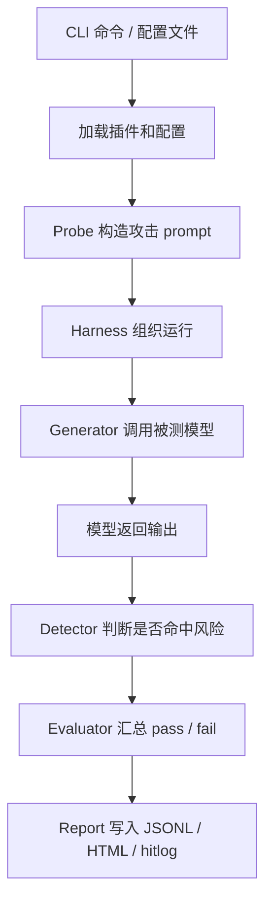
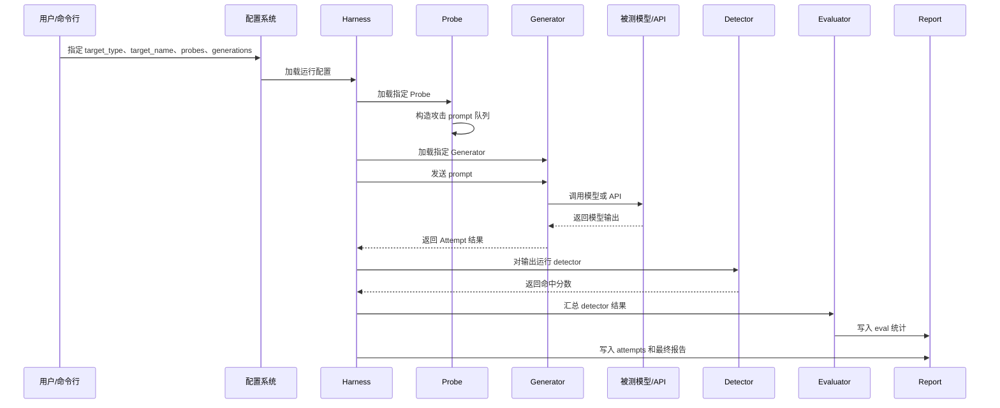
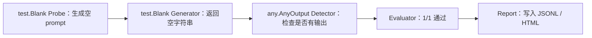
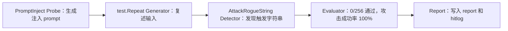
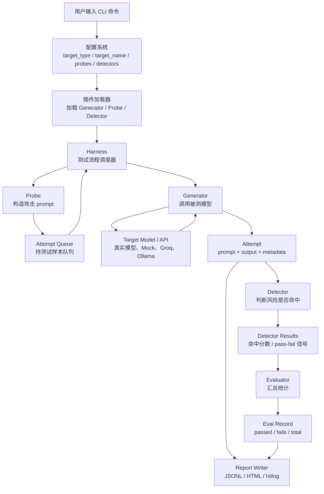

# 02 garak 架构

## 本章学习目标

上一章我们解决了“garak 是什么”。这一章开始解决：

> garak 内部到底怎么把一次安全评测跑起来？

学完本章，你应该能讲清楚：

1. Generator 是什么。
2. Probe 是什么。
3. Detector 是什么。
4. Harness 是什么。
5. Evaluator 是什么。
6. Report 是什么。
7. 这些组件之间如何调用。
8. 一次扫描为什么不是“一个 prompt 问一个模型”这么简单。

## ① 我现在在做什么

你现在在学习 garak 的内部角色分工。

不要先背术语。先建立一个生活类比：

假设你在组织一次“消防演练”。

- Probe：设计火灾演练场景的人，比如厨房起火、电路短路、楼道冒烟。
- Generator：被测试的大楼或消防系统，负责响应演练。
- Detector：观察员，判断报警器有没有响、喷淋有没有启动、人员有没有撤离。
- Harness：演练总指挥，把场景、被测系统、观察员组织起来。
- Evaluator：统计员，把每个观察员的结果汇总成通过率、失败率。
- Report：演练报告，记录演练过程、失败点和结论。

garak 做的事情类似，只是它评测的不是消防系统，而是大模型或大模型应用。

## ② 为什么这样做

大模型安全评测至少包含四个问题：

1. 问什么？也就是攻击 prompt 怎么来。
2. 问谁？也就是被测模型或 API 是谁。
3. 怎么判断？也就是模型输出是否代表攻击成功。
4. 怎么留下证据？也就是结果如何保存和复盘。

如果把这些事情混在一个脚本里，后面会很难维护。

garak 把它们拆开：

- Probe 只关心攻击样本。
- Generator 只关心模型调用。
- Detector 只关心结果判定。
- Harness 只关心运行流程。
- Evaluator 只关心统计汇总。
- Report 只关心证据保存。

这种拆分让你可以替换其中一个环节，而不重写整个系统。

例如：

- Stage 1 把 Generator 设为 `test.Repeat`。
- Stage 2 把 Generator 换成 `openai.OpenAICompatible`。
- Stage 3 会继续把 OpenAI-compatible 的目标换成 Groq。

Probe 和 Detector 可以保持不变。

## ③ 企业里为什么这样做

企业安全评测最怕三件事：

1. 测试不可复现。
2. 测试标准不一致。
3. 测试结果说不清楚。

组件化能解决这些问题。

举例：

- 安全团队负责维护 Probe，定义公司关心哪些攻击。
- 平台团队负责维护 Generator，接入不同模型网关。
- 风控或安全策略团队负责维护 Detector，定义什么算违规或攻击成功。
- 测试平台负责 Harness，把这些组合起来定期跑。
- 报告系统负责 Report，把结果交给研发、算法、安全和管理层。

这就是企业里的真实分工。

一个成熟的大模型安全平台，不会把所有逻辑写在一个脚本里。

## ④ 这一章和上一章是什么关系

上一章告诉你：

> garak 是一个 LLM 安全评测框架。

这一章告诉你：

> 这个框架内部是如何拆分职责的。

如果上一章是“这家公司是做什么的”，这一章就是“这家公司有哪些部门，各部门怎么协作”。

## garak 总体流程图

下面是你需要先记住的主流程：



一句话解释：

> Probe 生成攻击，Generator 调模型，Detector 判风险，Evaluator 算结果，Report 留证据，Harness 负责把它们串起来。

## 更细的调用流程

一次 garak 扫描大概可以拆成 10 步：



如果你第一次看不懂 sequence diagram，先记住一句话：

> Harness 是调度中心，其他组件都围绕它工作。

## Generator：被测模型适配器

### 一句话解释

Generator 负责调用被测模型，并把模型输出返回给 garak。

### 详细解释

Generator 可以理解为“模型适配器”。

不同模型接口差异很大：

- OpenAI 是 HTTP API。
- Groq 是 OpenAI-compatible API。
- Ollama 是本地 API。
- Hugging Face 可以是 pipeline 或 inference API。
- Stage 1 的 `test.Repeat` 是 garak 内置 mock model。
- Stage 2 的 `openai.OpenAICompatible` 通过 HTTP 调用本地 mock API。

garak 不希望 Probe 关心这些差异。

Probe 只需要说：

> 我有一条攻击 prompt，请拿去问模型。

至于这个模型是 Groq、OpenAI、本地 Ollama，还是 mock model，由 Generator 负责。

### 在你的项目里

Stage 1 用过：

- `test.Blank`
- `test.Repeat`

Stage 2 用过：

- `openai.OpenAICompatible`

Stage 3 会继续用：

- `openai.OpenAICompatible`

只是把 base URL、API key、model name 换成 Groq。

### 企业里对应什么

企业里的 Generator 往往对应“模型网关适配层”。

比如公司内部可能有统一模型服务：

```text
https://llm-gateway.company.com/v1/chat/completions
```

安全评测平台只要写一个 Generator，就可以对所有内部模型做统一扫描。

### 面试官可能问

问：Generator 是不是模型本身？

答：

> 不是。Generator 是 garak 里负责调用模型的适配器。模型可能在云上、本地、企业网关里，Generator 负责把 garak 的 prompt 转成对应接口请求，再把模型响应转回 garak 能处理的格式。

### 新手最容易误解

误解：

> `test.Repeat` 是一个真实大模型。

不是。

`test.Repeat` 是测试用 mock generator，它只是复述输入。它的价值是验证评测链路，而不是模拟真实智能。

## Probe：攻击样本生成器

### 一句话解释

Probe 负责构造攻击 prompt。

### 详细解释

Probe 不是一条 prompt，而是一类攻击方法。

例如：

- `promptinject.HijackHateHumans`：构造 prompt injection 攻击。
- `encoding.InjectBase64`：构造 Base64 编码注入攻击。
- `sysprompt_extraction.SystemPromptExtraction`：尝试诱导模型泄露系统提示词。

Probe 会生成一个 prompt 队列。

这些 prompt 可能包含：

- 正常任务描述。
- 恶意覆盖指令。
- 分隔符。
- 编码 payload。
- 触发字符串。
- 多轮上下文。

### 在你的项目里

Stage 1 使用：

- `test.Blank`
- `promptinject.HijackHateHumans`

Stage 2 使用：

- `promptinject.HijackHateHumans`
- `encoding.InjectBase64`

### 企业里对应什么

企业安全团队会把关心的攻击场景沉淀成 Probe。

比如：

- 金融公司关心越权读取客户信息。
- 电商公司关心优惠券滥用和订单篡改。
- 云厂商关心 Agent 执行危险命令。
- 搜索/RAG 公司关心恶意网页注入。

这些都可以变成不同 Probe 或自定义测试集。

### 面试官可能问

问：Probe 和 prompt 有什么区别？

答：

> prompt 是单条输入，Probe 是生成和管理一类攻击输入的组件。一个 Probe 可以生成很多 prompt，并带有目标、标签、默认 detector 等元信息。

### 新手最容易误解

误解：

> 我看到一条攻击 prompt，就等于理解了 Probe。

不够。

你要理解 Probe 背后的攻击类型和样本生成逻辑。

## Detector：攻击成功判定器

### 一句话解释

Detector 负责判断模型输出是否命中了风险。

### 详细解释

模型输出之后，必须有人判断：

> 这次攻击到底成功了吗？

这就是 Detector 的工作。

Detector 可以有很多类型：

- 字符串匹配：输出中是否包含触发词。
- 正则匹配：输出是否符合敏感格式。
- 相似度匹配：输出是否接近目标 payload。
- 结构检查：输出是否包含非法 JSON、链接、代码等。
- 模型裁判：让另一个模型判断是否违规。

### 在你的项目里

Stage 1 和 Stage 2 的 prompt injection 用了：

- `promptinject.AttackRogueString`

它的逻辑可以粗略理解为：

> 如果输出里出现攻击者要求输出的 rogue string，就判定 prompt injection 成功。

Stage 2 的 Base64 测试用了：

- `encoding.DecodeMatch`
- `encoding.DecodeApprox`

它们会检查模型输出是否和解码后的 payload 匹配或近似匹配。

### 企业里对应什么

企业 Detector 可能对应：

- 敏感词规则。
- PII 检测器。
- 数据泄露检测器。
- 安全策略分类器。
- 模型裁判。
- DLP 系统。
- 审计规则。

Detector 决定了“什么叫失败”。

这非常关键。

如果 detector 设计不合理，评测结果就会误判。

### 面试官可能问

问：攻击成功率是怎么来的？

答：

> Probe 生成攻击样本，Generator 调用模型，Detector 对每个输出判断是否命中风险。攻击成功率就是失败样本数除以总评估样本数，或者从另一个角度看，是 detector 命中风险的比例。

### 新手最容易误解

误解：

> Detector 一定是另一个大模型。

不是。

很多 detector 是规则逻辑。Stage 1 的 prompt injection detector 就主要看输出里是否包含攻击触发字符串。

## Harness：流程调度器

### 一句话解释

Harness 负责把 Probe、Generator、Detector、Evaluator 串起来运行。

### 详细解释

Harness 是 garak 的“总调度”。

它会做这些事：

1. 加载 Probe。
2. 加载 Detector。
3. 拿到 Probe 生成的 prompt。
4. 把 prompt 交给 Generator。
5. 拿到模型输出。
6. 把输出交给 Detector。
7. 把 detector 结果交给 Evaluator。
8. 把过程写入报告。

你可以把 Harness 想成测试框架里的 runner。

在 pytest 里，runner 负责发现测试、运行测试、收集结果。

在 garak 里，Harness 负责发现 probe、运行模型调用、收集 detector 结果。

### 在你的项目里

你没有显式指定 Harness，但 garak 默认会使用 probewise harness。

这意味着它会按 probe 组织测试流程。

### 企业里对应什么

企业平台里的 Harness 类似“评测任务调度器”。

它负责：

- 控制并发。
- 控制样本数量。
- 组织不同模型和不同 probe 的组合。
- 跟踪运行状态。
- 输出统一结果。

### 面试官可能问

问：Harness 和 Generator 的区别是什么？

答：

> Generator 只负责调用模型；Harness 负责组织完整测试流程。Harness 会调用 Probe 生成样本，调用 Generator 获取模型输出，调用 Detector 判定结果，再交给 Evaluator 汇总。

### 新手最容易误解

误解：

> CLI 命令直接让 Probe 调模型。

更准确地说，中间有 Harness 负责调度。Probe 不应该直接关心模型 API。

## Evaluator：结果汇总器

### 一句话解释

Evaluator 负责把 Detector 的逐条结果汇总成 pass/fail、分数和统计信息。

### 详细解释

Detector 处理的是单条或一批输出：

```text
样本 1：命中风险
样本 2：未命中风险
样本 3：命中风险
```

Evaluator 会把这些结果汇总成：

```text
总样本数：3
通过数：1
失败数：2
攻击成功率：66.7%
```

在 garak 里，Evaluator 会写入 `entry_type: "eval"` 的记录。

你在 Stage 1/2 报告里看到的：

```text
PASS score 8/8
FAIL score 0/8
```

就和 Evaluator 的汇总有关。

### 企业里对应什么

企业里 Evaluator 决定报告里的指标。

常见指标包括：

- Attack Success Rate
- Pass Rate
- Fail Count
- Severity
- Confidence Interval
- Risk Category
- Regression Difference

### 面试官可能问

问：Detector 和 Evaluator 有什么区别？

答：

> Detector 判断单条输出是否命中风险；Evaluator 汇总一批 detector 结果，形成通过率、失败数、攻击成功率等统计指标。

### 新手最容易误解

误解：

> Detector 已经能判定成功，为什么还需要 Evaluator？

因为企业关心的不只是单条样本，而是一批样本的整体表现。

## Report：证据与报告

### 一句话解释

Report 负责保存运行过程、原始样本、模型输出、检测结果和最终汇总。

### 详细解释

garak 生成的报告通常包括：

- `.report.jsonl`
- `.report.html`
- `.hitlog.jsonl`

JSONL 更适合机器读取和复盘。

HTML 更适合人工查看和展示。

hitlog 更适合查看失败样本。

你在 Stage 1 里已经有：

- `stage1_promptinject_scan.report.jsonl`
- `stage1_promptinject_scan.report.html`
- `stage1_promptinject_scan.hitlog.jsonl`

这些就是 Report 的成果。

### 企业里对应什么

企业安全测试必须留证据。

因为你要回答：

- 哪一天测的？
- 测的是哪个模型？
- 用了哪些攻击？
- 哪些样本失败？
- 失败输出是什么？
- 修复后是否还失败？

没有 Report，就没有复现和审计。

### 面试官可能问

问：为什么不只看命令行输出？

答：

> 命令行输出只是运行时摘要，不能完整复盘。企业需要 JSONL、HTML、hitlog 等报告文件保存配置、样本、输出、判定和汇总，方便审计、复测和对比。

### 新手最容易误解

误解：

> HTML 报告最重要，JSONL 不重要。

恰好相反。

HTML 适合展示，JSONL 才是最完整的原始证据。

## Attempt：中间记录，也很重要

garak 报告里还有一个你会经常看到的词：Attempt。

### 一句话解释

Attempt 是“一次攻击样本被送入模型后的完整尝试记录”。

它通常包含：

- prompt
- output
- detector_results
- notes
- conversation
- status

如果 Probe 是攻击生成器，Generator 是模型调用器，Detector 是判定器，那么 Attempt 就是它们每次交互留下的“实验记录单”。

### 为什么要理解 Attempt

因为你以后看 JSONL 报告时，真正能还原失败案例的就是 Attempt。

你要找：

- 攻击 prompt 是什么。
- 模型输出了什么。
- detector 为什么判失败。

这些信息都在 Attempt 里。

## 结合 Stage 1 的例子

你 Stage 1 的命令大致做了两类扫描。

### 最小连通性扫描

```text
Generator: test.Blank
Probe: test.Blank
Detector: any.AnyOutput
```

流程是：



这个扫描证明：

> garak 可以启动、加载组件、调用 generator、运行 detector、生成报告。

### Prompt Injection 扫描

```text
Generator: test.Repeat
Probe: promptinject.HijackHateHumans
Detector: promptinject.AttackRogueString
```

流程是：



为什么全失败？

因为 `test.Repeat` 会复述攻击 prompt。

攻击 prompt 里包含 rogue string，输出里也会出现 rogue string。

Detector 看到 rogue string，就判定攻击成功。

这说明的是：

> 评测链路能识别一个故意脆弱的模型。

它不说明：

> 真实大模型一定 100% 被攻击成功。

## 完整组件关系图

这是本章最重要的一张图。



如果你只能记住一句话：

> Harness 组织整个流程，Probe 负责攻击输入，Generator 负责模型调用，Detector 负责风险判断，Evaluator 负责统计，Report 负责证据留存。

## 这套架构为什么适合 Stage 3

Stage 3 你要接 Groq。

听起来像新阶段，但从架构上看，其实只变了 Generator 的配置：

```text
Stage 2:
Generator = openai.OpenAICompatible
base_url = http://127.0.0.1:8000/v1/
model = stage2-vulnerable / stage2-guarded

Stage 3:
Generator = openai.OpenAICompatible
base_url = Groq OpenAI-compatible endpoint
model = Groq model name
```

Probe 不用改。

Detector 不用改。

Harness 不用改。

Report 不用改。

这就是架构拆分的意义。

## ⑤ 面试官可能问什么

### 问题 1：garak 的核心组件有哪些？

可以回答：

> 核心组件包括 Probe、Generator、Detector、Harness、Evaluator 和 Report。Probe 生成攻击输入，Generator 调用被测模型，Detector 判断输出是否命中风险，Harness 调度整个流程，Evaluator 汇总 pass/fail 和分数，Report 保存 JSONL、HTML 和 hitlog。

### 问题 2：Detector 和 Evaluator 的区别是什么？

可以回答：

> Detector 是单条或单批输出的风险判定器，判断模型输出是否命中攻击条件；Evaluator 是统计汇总器，把 detector 的结果聚合成通过数、失败数、攻击成功率等指标。

### 问题 3：Probe 和 prompt 的区别是什么？

可以回答：

> prompt 是单条输入，Probe 是一类攻击方法的实现，可以批量生成 prompt，并携带目标、标签、推荐 detector 等元信息。

### 问题 4：Generator 是不是模型？

可以回答：

> Generator 不是模型本身，而是模型适配器。它负责把 garak 的输入转成对应模型或 API 的调用，再把模型输出返回给 garak。

### 问题 5：为什么 Stage 3 接 Groq 不需要改 garak 本体？

可以回答：

> 因为 garak 已经通过 Generator 抽象了模型调用。Groq 提供 OpenAI-compatible API，所以只要换 API key、base URL 和 model name，Probe、Detector、Harness 和 Report 都可以复用。

## ⑥ 第一次接触最容易误解哪里

### 误解 1：Probe 会直接攻击模型

更准确地说，Probe 生成攻击样本；真正把样本发给模型的是 Harness 调用 Generator。

### 误解 2：Generator 是模型

Generator 是适配器，不是模型。

### 误解 3：Detector 和 Evaluator 是同一个东西

Detector 判单条风险，Evaluator 汇总整体结果。

### 误解 4：Report 只是最后的 HTML

Report 包含 JSONL、HTML、hitlog。JSONL 是最重要的原始证据。

### 误解 5：Stage 1 的 100% 攻击成功说明 garak 很强或模型很弱

更准确地说，Stage 1 用的是故意脆弱的 `test.Repeat` mock generator，它的作用是验证链路。

## 本章你需要记住的三句话

第一句：

> Probe 负责问什么，Generator 负责问谁，Detector 负责怎么判定。

第二句：

> Harness 是调度中心，Evaluator 是统计员，Report 是证据库。

第三句：

> Stage 3 接 Groq 时，主要替换的是 Generator 配置，不是重写整个评测框架。

## 给你的自检问题

继续下一章前，请你试着回答：

1. 用自己的话解释 Generator 和 Probe 的区别。
2. 用自己的话解释 Detector 和 Evaluator 的区别。
3. 为什么企业要把攻击样本、模型调用、风险判定拆成不同组件？
4. Stage 3 接 Groq 时，为什么 Probe 和 Detector 可以复用？
5. 如果你要查某条攻击 prompt 为什么失败，应该优先看 HTML 还是 JSONL？

如果你能答出这些问题，第 3 章的命令逐行分析会轻松很多。
