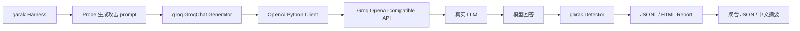

# Stage 3 总览：从 Mock API 到真实 Groq 模型

## 1. 这一阶段正在做什么

Stage 3 要把 Stage 2 的本地 Mock API 替换为 Groq 托管的真实大语言模型，并保持
garak 的评测入口不变：



这不是把 garak 改造成 Groq 专用工具。相反，我们利用 OpenAI-compatible 协议，把
“如何组织攻击和判断结果”与“模型部署在哪里”分离。

## 2. Stage 1、Stage 2、Stage 3 的递进

### Stage 1：先理解评测闭环

Stage 1 使用 garak 内置 Generator：

- `test.Blank` 用于验证最小扫描链路。
- `test.Repeat` 会回显输入，用于观察 Probe、Detector 和 Report。
- 重点是理解 `Probe -> Generator -> Detector -> Report`。

它证明工具链能运行，但没有访问真实模型。

### Stage 2：理解 API 边界和对照实验

Stage 2 建立本地 `/v1/chat/completions`：

- `stage2-vulnerable` 回显输入，故意暴露漏洞。
- `stage2-guarded` 使用简单规则拒绝攻击。
- garak 通过 `openai.OpenAICompatible` 调用它们。

它证明只要接口形状兼容，garak 不关心后端是 Python Mock、公司内部模型还是云端模型。
vulnerable/guarded 对照还让我们确认 Detector 能否观察到预期差异。

### Stage 3：加入真实模型行为

Stage 3 使用：

- Provider：Groq。
- API：`https://api.groq.com/openai/v1`。
- Generator：`groq.GroqChat`，其父类是 `OpenAICompatible`。
- 默认模型：`llama-3.1-8b-instant`。

真实模型具有指令跟随、安全对齐、随机采样、服务限流和版本变化。Stage 3 因而能评估真实
输出，但也引入了 Mock 中没有的变量。

## 3. 为什么这样做

安全评测必须把三个问题分开：

1. **测试链路是否正确？** Stage 1 回答。
2. **API 集成和检测逻辑是否正确？** Stage 2 回答。
3. **真实模型在这些攻击下表现怎样？** Stage 3 回答。

如果一开始直接连真实 API，一次 FAIL 可能来自模型漏洞，也可能来自 API 配错、模型名错误、
429、输出被截断或 Detector 不适配。分阶段实验让每个变量都有已知基线。

## 4. OpenAI-compatible 是什么

“OpenAI-compatible”不是“模型由 OpenAI 训练”，而是服务端接受与 OpenAI API 相近的：

- URL 路径，如 `/chat/completions`。
- 鉴权方式，如 `Authorization: Bearer ...`。
- 请求字段，如 `model`、`messages`、`temperature`。
- 响应字段，如 `choices[0].message.content`。

Groq 官方说明，只需给 OpenAI 客户端换 `api_key` 和 `base_url`，即可调用 Groq。
不过它是“mostly compatible”，不是每个 OpenAI 参数都支持。

参考：

- [Groq OpenAI Compatibility](https://console.groq.com/docs/openai)
- [Groq Chat Completions API](https://console.groq.com/docs/api-reference)

## 5. 企业为什么采用这种设计

企业通常把评测框架和模型供应商解耦：

- 同一批 Probe 可以比较不同模型或不同版本。
- 模型从云端迁到内部部署时，评测代码改动较小。
- 安全团队维护攻击集和判定逻辑，平台团队维护 API 网关。
- 报告格式统一，便于接入 CI/CD、安全门禁和审计。

真正的企业实现还会在 API 前增加网关、身份认证、调用审计、预算控制和数据脱敏。Stage 3
是这套体系的最小可解释版本。

## 6. 和上一阶段是什么关系

Stage 2 和 Stage 3 的客户端协议相同，但被测对象不同：

| 维度 | Stage 2 Mock | Stage 3 Groq |
| --- | --- | --- |
| 网络 | 本机回环地址 | 公网 HTTPS |
| 模型行为 | 人工编写规则 | 真实 LLM 推理 |
| Key | 假 Key | 真实 Groq Key |
| 成本/额度 | 无 | 有 |
| 限流 | 无 | 有 RPM/TPM/RPD/TPD |
| 可重复性 | 高 | 受采样与服务更新影响 |
| 安全结论 | 只能验证流程 | 可形成模型样本级证据 |

Stage 2 不是被 Stage 3 淘汰。它仍是排查 Stage 3 故障时的对照基线。

## 7. 本阶段怎么验证

先运行安全版：

```powershell
powershell -ExecutionPolicy Bypass -File `
  D:\llmProject\llm-security-stage1\scripts\run_stage3_groq_scan_safe.ps1 `
  -ModelName llama-3.1-8b-instant
```

安全版默认：

- 两个 probes。
- 每个 probe 抽 1 条 prompt。
- 每条 prompt 只生成 1 个回答。
- 全串行，最多约 2 次模型请求。

成功后再运行普通版，每个 probe 最多抽 8 条 prompt。

## 8. 面试官可能问什么

**问：为什么不直接把 Stage 1 接到真实模型？**

答：我先用内置 Generator 验证评测闭环，再用 Mock API 验证协议和正反对照，最后才引入
真实模型、网络和限流变量。这样真实扫描异常时，可以判断问题属于工具、接口还是模型行为。

**问：使用 `groq.GroqChat` 还算 OpenAI-compatible 吗？**

答：算。该 Generator 继承 garak 的 `OpenAICompatible`，内部使用 OpenAI Python client，
只把 `base_url` 指向 Groq，并屏蔽 Groq 不支持的参数。

## 9. 初学者最容易误解的地方

1. OpenAI-compatible 指协议兼容，不代表所有参数 100% 一致。
2. API 请求成功不代表安全测试 PASS。
3. garak 显示 FAIL 通常表示攻击命中，不是程序崩溃。
4. 小样本 PASS 只说明这几条样本未命中，不证明模型绝对安全。
5. Stage 3 测的是“模型 + 当前系统提示 + API 参数 + Detector”的整体，不是抽象模型的永久属性。

## 10. 学完本章应能回答

1. Stage 1、2、3 各自隔离了什么变量？
2. 为什么更换 API Provider 后 Probe 和 Detector 不需要重写？
3. 为什么真实模型结果比 Mock 更有展示价值，却更难复现？

