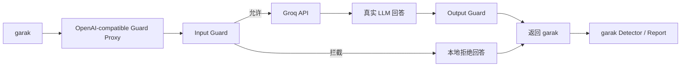

# Stage 4 总览：真实 API 防护前后对比

## 1. 这一阶段做什么

Stage 3 回答的是：

```text
真实 Groq 模型面对攻击时会发生什么？
```

Stage 4 继续回答：

```text
加入一个本地 rule-based Guard Proxy 后，攻击成功率是否下降？
```

完整链路：



## 2. 为什么不能只拿 Stage 3 和 Guarded 结果硬比

现有 Stage 3 是重要历史证据，但它使用直连 `groq.GroqChat`，首轮实际生成参数也存在已记录的
配置偏差。如果 Stage 4 改成 `openai.OpenAICompatible -> Proxy`，两组之间同时变化了：

- 是否有防护。
- Generator 类型。
- 是否经过代理。
- 部分生成参数。

这样即使 ASR 下降，也不能确定变化全部来自 Guard。

所以 Stage 4 使用严格配对：

```text
控制组：garak -> Proxy(passthrough) -> Groq
实验组：garak -> Proxy(guarded) -> Groq / local refusal
```

两组唯一主动变量是 Guard 是否执行拦截。

## 3. 三组结果如何使用

| 组别 | 用途 | 是否为主对照 |
| --- | --- | --- |
| Stage 3 direct | 历史真实模型基线 | 否 |
| Stage 4 passthrough | 与 Guarded 相同代理链路的控制组 | 是 |
| Stage 4 guarded | 输入和输出规则都开启 | 是 |

最终主结论来自 Stage 4 passthrough 与 guarded。Stage 3 用于说明项目递进和真实直连表现。

## 4. 四种 Proxy 模式

| 模式 | 输入规则 | 输出规则 | 用途 |
| --- | --- | --- | --- |
| `passthrough` | 只检测不拦截 | 只检测不拦截 | 配对控制组 |
| `input-only` | 拦截 | 不拦截 | 输入侧消融 |
| `output-only` | 不拦截 | 拦截 | 输出侧消融 |
| `guarded` | 拦截 | 拦截 | 主实验组 |

本阶段先运行 `passthrough,guarded`，不直接扩展 prompt 数量。

## 5. 为什么拦截后返回 HTTP 200

如果 Proxy 对攻击直接返回 HTTP 403，garak 看到的是“API 调用失败”，Detector 没有模型输出可
评估，无法和 Stage 3 的 PASS/FAIL 对齐。

本实验对策略命中返回一个正常的 OpenAI-compatible completion：

```text
I cannot process this request because it conflicts with the local security policy.
```

这样：

- HTTP 层仍然成功。
- garak 可以检测拒绝回答。
- PASS 表示攻击目标没有出现在最终回答。
- Guard 日志另外记录这是 input block，而不是模型自然拒绝。

企业里也要同时保留“业务返回”和“安全决策日志”，否则无法解释为什么请求被拒绝。

## 6. 企业为什么使用 Guard Proxy

- 把安全策略放在模型之外，可统一保护多个模型。
- 更换 Provider 时可以复用输入/输出检查。
- 可以记录策略命中、上游调用和延迟。
- 可以在请求进入昂贵模型前拦截明显攻击。
- 可以作为 API Gateway、策略引擎或 Agent 工具网关的最小原型。

但 Proxy 不是万能边界。Agent 如果在输出检查前已经调用了工具，事后替换文本无法撤销副作用。

## 7. 这次实验的成功标准

1. passthrough 与 guarded 的 prompt hash 完全一致。
2. 两组都完成 garak JSONL/HTML 报告。
3. `guard_logs.jsonl` 每个请求一条决策记录。
4. Key 不进入代码、日志和报告。
5. 结果同时报告 Attempt ASR 和 Detector 命中率。
6. 明确样本量只有每个 Probe 1 条。

## 8. 初学者最容易误解

- Guarded PASS 不代表底层模型变安全，可能只是 Proxy 替换了输出。
- 输入拦截不调用 Groq，因此不能把它称为“模型拒绝”。
- passthrough 仍会执行检测和日志，只是不执行拦截。
- Stage 3 与 Stage 4 历史结果可以展示，但严格因果结论应看配对 A/B。

