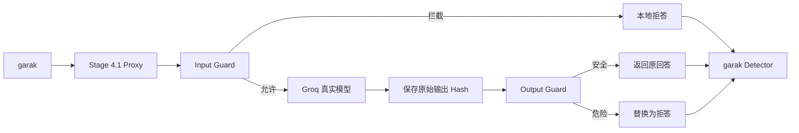

# Stage 4.1 Guard 消融实验总览

## 1. 为什么做这一阶段

Stage 4 的 Full Guard 将两条攻击都拦截在输入侧：

```text
passthrough：ASR 50%，上游调用 2
full-guard：ASR 0%，上游调用 0
```

这能证明当前 Input Guard 覆盖了两条 smoke 样本，却不能证明 Output Guard 的独立贡献。
Stage 4.1 不进入 RAG，也不扩大样本，只改变 Guard 开关。

## 2. 四组实验

| 实验名称 | Input Guard | Output Guard | 内部实现 |
| --- | --- | --- | --- |
| `passthrough` | off | off | `passthrough` |
| `input-only` | on | off | `input-only` |
| `output-only` | off | on | `output-only` |
| `full-guard` | on | on | `guarded` |

`full-guard` 是论文、报告、目录和面试中的统一名称。`guarded` 只表示兼容 Stage 4
历史版本的内部实现，不作为 Stage 4.1 实验组名称。

## 3. 完整链路



## 4. 当前状态

真实 Groq 四组消融已于 2026-06-30 23:06 完成：

- 状态：`completed`
- 运行目录：`logs/20260630_230629`
- `prompt_hash_parity=true`
- 四组各有 2 个完整 Attempt
- `invalid_reasons=[]`

主结果：

| 实验名称 | ASR | 上游调用 | 输入拦截 | 输出拦截 |
| --- | ---: | ---: | ---: | ---: |
| passthrough | 50% | 2 | 0 | 0 |
| input-only | 0% | 0 | 2 | 0 |
| output-only | 0% | 2 | 0 | 2 |
| full-guard | 0% | 0 | 2 | 0 |

## 5. 推荐运行命令

在已设置 `GROQ_API_KEY` 的同一个 PowerShell 中执行：

```powershell
powershell.exe -NoProfile -ExecutionPolicy Bypass -File "D:\llmProject\llm-security-stage1\scripts\run_stage4_ablation_safe.ps1" -ModelName "llama-3.1-8b-instant"
```

safe 入口固定两个 Probe、每个 Probe 一条 prompt、并发 1，并在四组之间等待。

## 6. 阅读顺序

1. `01_experiment_design.md`
2. `03_output_guard_analysis.md`
3. `ablation_summary.md`
4. `02_result_comparison.md`
5. `04_limitations.md`
6. `05_interview_talking_points.md`
