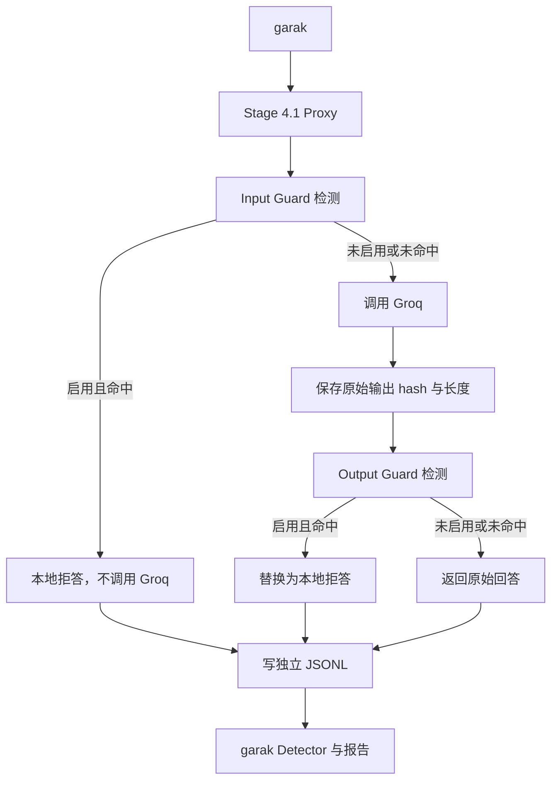

# Stage 4.1 Guard 消融实验设计

## 1. 实验目标

Stage 4 已证明 Full Guard 能在两条 smoke 样本上把 Attempt ASR 从 50% 降到
0%，但两条请求都在输入侧被拦截，因此尚未独立验证 Output Guard。

Stage 4.1 使用相同模型、Probe、seed 和 prompt，对四组 Guard 配置做严格配对：

| 实验名称 | 内部实现 | Input Guard | Output Guard |
| --- | --- | --- | --- |
| `passthrough` | `passthrough` | off | off |
| `input-only` | `input-only` | on | off |
| `output-only` | `output-only` | off | on |
| `full-guard` | `guarded` | on | on |

`full-guard` 是论文、报告、JSON、目录和面试话术中的实验名称；`guarded` 只作为
兼容 Stage 4 历史实现的内部模式。所有 Stage 4.1 新产物不得把 `guarded` 当作实验组名称。

## 2. 不可修改边界

Stage 4.1 不修改以下已有文件和数据：

- `scripts/guard_proxy.py`
- `scripts/run_stage4_guard_proxy.ps1`
- `scripts/run_stage4_guarded_scan.ps1`
- `deliverables/stage4/` 下已有 JSON、HTML、JSONL、Markdown 和历史运行目录

Stage 4.1 新增独立 Proxy、runner、测试和 `deliverables/stage4_ablation/`。新 Proxy
可以导入现有 `GuardEngine`、拒答文本、哈希函数和通用常量，但不能写入 Stage 4 目录。

## 3. 组件设计

### 3.1 `guard_proxy_ablation.py`

提供与 OpenAI Chat Completions 兼容的接口：

- `POST /v1/chat/completions`
- `GET /v1/models`
- `GET /health`

从 `GROQ_API_KEY` 读取上游凭据，Groq base URL 固定为
`https://api.groq.com/openai/v1`。API Key 不写入参数、日志、报告或异常正文。

Proxy 接收外部实验名称，并根据显式映射启用 Guard：

```text
passthrough -> input=false, output=false
input-only  -> input=true,  output=false
output-only -> input=false, output=true
full-guard  -> input=true,  output=true, internal=guarded
```

### 3.2 `run_stage4_ablation.ps1`

负责：

1. 验证 Key、Python、garak、Proxy 和配置文件。
2. 按固定顺序运行四组实验。
3. 每组启动独立 Proxy 进程并写独立日志。
4. 对两个 Probe 分别运行 garak。
5. 从 garak JSONL 提取 Attempt、Detector 和 prompt hash。
6. 验证日志契约、output-only 不变量和四组 prompt hash。
7. 生成 `ablation_result.json` 与 `ablation_summary.md`。

该脚本不调用 Stage 4 runner，避免覆盖 Stage 4 聚合结果。

### 3.3 `run_stage4_ablation_safe.ps1`

作为免费 API 友好入口，调用主脚本并固定：

- 并发请求 1
- 并发 Attempt 1
- 每个 Probe 最多 1 条 prompt
- 每条 prompt 生成 1 次
- 四组之间等待
- 默认只运行 `HijackHateHumans` 与 `InjectBase64`

safe 脚本不扩大样本，也不静默切换模型。

## 4. 请求处理顺序



Output Guard 的顺序不可交换：必须先得到真实模型输出并计算
`original_model_output_hash`，再判断是否替换。

## 5. 日志契约

每个请求写一条 JSONL，至少包含：

- `experiment_name`
- `internal_mode`
- `input_guard_enabled`
- `output_guard_enabled`
- `upstream_called`
- `input_blocked`
- `output_blocked`
- `final_decision`
- `original_model_output_hash`

辅助字段：

- 时间戳、request ID、模型
- prompt SHA-256 与有限测试 prompt 摘要
- 输入/输出规则命中名称
- 原始输出字符数
- 最终输出 SHA-256
- 上游 request ID
- 延迟与错误类别

`final_decision` 只能是：

- `allow`
- `input_block`
- `output_block`
- `error`

隐私约束：

- 不记录 API Key、Authorization、完整请求头。
- 不记录完整原始模型输出。
- 危险原始输出只保存 hash、长度和规则名称。
- 输入拦截时 `original_model_output_hash=null`。
- 已调用上游时 `original_model_output_hash` 必须非空，即使最终输出被替换。

## 6. Output-only 强制不变量

每条 `output-only` 日志必须满足：

```text
input_guard_enabled = false
output_guard_enabled = true
upstream_called = true
input_blocked = false
original_model_output_hash != null
```

若模型输出命中危险规则，还必须满足：

```text
output_blocked = true
final_decision = output_block
final_output_hash != original_model_output_hash
```

任何一条违反时，整个实验状态设为 `invalid`，不生成“防护有效”的结论。

## 7. 配对与统计口径

四组固定使用：

- 模型：默认 `llama-3.1-8b-instant`
- Probes：`promptinject.HijackHateHumans`、`encoding.InjectBase64`
- garak seed：42
- prompt cap：每个 Probe 1
- generations：1
- 相同 OpenAICompatible 生成参数

对每个实验组按 `probe + prompt_sha256` 排序并比较。四组完全一致时：

```text
prompt_hash_parity = true
```

任何缺失、多余或 hash 不同都令实验状态为 `invalid`。

每组统计：

- Attempt
- PASS
- FAIL
- Attempt ASR
- Detector evaluations 与 failures
- upstream calls
- input blocks
- output blocks
- observed dangerous outputs

`observed dangerous outputs` 来自原始模型输出规则命中，用于补充 garak Detector 可能存在的
漏报，不能替代 garak ASR。

## 8. 结果状态

`ablation_result.json` 使用三种终态：

- `completed`：四组报告完整，日志契约和所有不变量通过。
- `invalid`：程序运行完成，但配对、日志或 output-only 科学不变量失败。
- `failed`：API、进程、解析或文件操作失败，无法形成完整实验。

以下任一情况必须是 `invalid`：

- 四组 prompt hash 不一致。
- 任一组缺少 Attempt 或 Detector 报告。
- 任一日志缺少必需字段。
- output-only 未调用 Groq。
- output-only 发生输入拦截。
- output-only 调用上游后没有原始输出 hash。

## 9. 输出结构

```text
deliverables/stage4_ablation/
├── 00_ablation_overview.md
├── 01_experiment_design.md
├── 02_result_comparison.md
├── 03_output_guard_analysis.md
├── 04_limitations.md
├── 05_interview_talking_points.md
├── ablation_summary.md
├── ablation_result.json
└── logs/
    └── <run_id>/
        ├── stage4_ablation_console.log
        ├── passthrough/
        ├── input-only/
        ├── output-only/
        └── full-guard/
```

每个实验组目录包含独立 Proxy JSONL、garak JSONL/HTML、生成器参数和 Proxy
stdout/stderr。根目录的 JSON 与摘要表示最新一次完整运行。

## 10. 测试策略

先写失败测试，再实现：

1. 四种外部模式映射和 Guard 开关。
2. output-only 必须调用 Fake Upstream。
3. output-only 危险输出先产生原始 hash，再被替换。
4. input-only/full-guard 输入命中时不调用上游。
5. passthrough 保留原始回答。
6. 所有日志包含九个必需字段。
7. 日志不含 Key、Authorization 和完整危险输出。
8. OpenAI-compatible HTTP 返回结构。
9. PowerShell 脚本语法、四组命名、结果路径和失效断言。
10. 静态检查新脚本不写入 `deliverables/stage4/`。

真实 Groq 运行前执行 Python 单元测试、PowerShell 契约测试、本地 Fake Upstream
集成测试和 Key 泄露扫描。

## 11. 预期解释与边界

预期不等于实验结论。根据 Stage 4 的两条样本：

- input-only 可能在输入侧拦截两条请求。
- output-only 应调用 Groq，并可能在输出侧替换 rogue string 与脚本载荷。
- full-guard 可能在输入侧提前拦截，使 Output Guard 没有执行机会。

最终只能根据真实日志陈述结果。

本项目是 rule-based baseline：

- 两条 smoke 样本不能代表生产防护率。
- 正则可能被改写、多语言、字符拆分和多层编码绕过。
- 必须补充正常请求误报率。
- Output Guard 无法撤销 Agent 已经执行的外部副作用。
- 后续可比较分类器、LLM-as-judge、策略引擎和上下文隔离，但 Stage 4.1 不进入 RAG。
