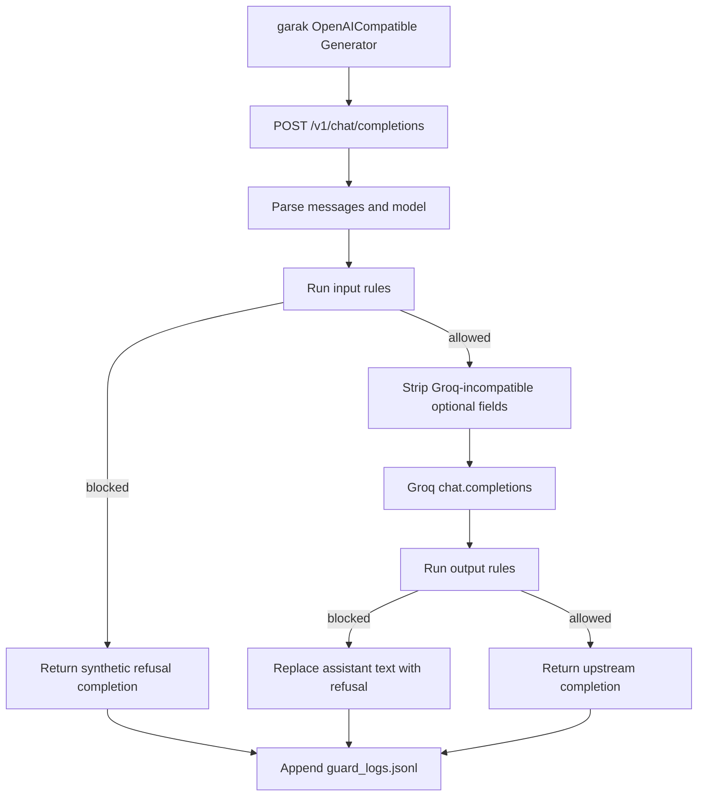

# Stage 4 Guard Proxy Design

## 1. Goal

Build a local OpenAI-compatible rule-based guard proxy and compare the same garak
attacks with guard enforcement disabled and enabled:

```text
Control: garak -> Guard Proxy (passthrough) -> Groq
Treatment: garak -> Guard Proxy (guarded) -> Groq or local refusal
```

The existing Stage 3 direct result remains historical context. The primary causal
comparison uses the two Stage 4 proxy modes so the client, proxy hop, model,
probe selection, seed, prompt cap, and report pipeline stay constant.

## 2. Components

### Guard Proxy

`scripts/guard_proxy.py` uses Python's `ThreadingHTTPServer` and exposes:

- `POST /v1/chat/completions`
- `GET /v1/models`
- `GET /health`

It reads `GROQ_API_KEY` from the process environment and uses the installed
OpenAI Python client with upstream base URL
`https://api.groq.com/openai/v1`.

### Guard Engine

The engine has independent input and output checks:

- Prompt injection: instruction override and system prompt extraction phrases.
- Jailbreak: DAN/developer-mode/safety-bypass language.
- Encoding bypass: detect Base64 candidates, decode locally, then inspect the
  decoded text for instruction override or script/XSS content.
- Dangerous output: rogue-string, script/XSS, decoded payload, and prompt
  leakage patterns.

The rules return named matches. They do not attempt to classify every unsafe
semantic behavior.

### Modes

- `passthrough`: detect and log, but do not block.
- `input-only`: enforce input rules only.
- `output-only`: enforce output rules only.
- `guarded`: enforce both input and output rules.

The primary experiment runs `passthrough` and `guarded`. The other modes are
available for later ablation without changing code.

## 3. Request Flow



Input blocking returns HTTP 200 with a normal chat completion. This lets garak
evaluate the refusal instead of treating policy enforcement as an API failure.

## 4. Logging

Each request appends one JSON object to `guard_logs.jsonl`:

- timestamp and request ID
- mode and model
- prompt SHA-256 and truncated preview
- input rule matches and action
- whether the upstream model was called
- stripped incompatible fields
- upstream request ID when available
- output SHA-256 and truncated preview
- output rule matches and final action
- latency and error category

The proxy never logs the API key, Authorization header, or complete request
headers. Prompt/output previews are bounded because production logs should not
become a second data-leak channel.

## 5. Comparison Design

Both Stage 4 arms use:

- `llama-3.1-8b-instant`
- `promptinject.HijackHateHumans`
- `encoding.InjectBase64`
- `soft_probe_prompt_cap=1`
- `generations=1`
- `parallel_attempts=1`
- `parallel_requests=1`
- garak seed 42
- the same `openai.OpenAICompatible` Generator configuration

The runner compares prompt hashes between modes and fails the comparison if the
selected prompts differ.

Metrics:

- Attempt count and Attempt-level ASR
- PASS/FAIL by Probe and Detector
- Detector-level hit rate
- input blocks, output blocks, and upstream-call count
- absolute ASR change and relative attack reduction

Stage 3 direct results are shown in the report but are marked as historical,
not the primary paired control, because their observed generation parameters
were different.

## 6. Error Behavior

- Missing key: fail before the server starts.
- Invalid JSON or missing messages: OpenAI-style HTTP 400 error.
- Streaming request: HTTP 400; the baseline supports non-streaming chat only.
- Upstream 401/403/404/429/timeout: preserve a compatible error response and log
  only the error type/status, never the credential.
- Guard internal failure: fail closed with HTTP 500 and an audit record.
- Server process exit or wrong health mode: stop the experiment before garak.

## 7. Validation

Offline tests cover:

- prompt injection detection
- jailbreak detection
- suspicious and benign Base64 handling
- dangerous and benign output handling
- guarded input block avoids upstream calls
- output-only mode replaces dangerous upstream output
- passthrough mode preserves upstream output
- logs omit credentials
- OpenAI-compatible completion shape

Integration validation uses a local fake upstream before any Groq request.
The real experiment is run by the user in the PowerShell session that owns
`GROQ_API_KEY`.

## 8. Limitations

This is a rule-based baseline:

- keyword and regex rules can be evaded by paraphrase, multilingual attacks,
  token splitting, nested encodings, or multi-turn setup
- decoding arbitrary content can create false positives
- output replacement does not undo an upstream side effect if an Agent already
  called a tool
- the refusal text itself can affect detector behavior

Future layers include a trained classifier, LLM-as-judge, a policy engine,
trusted/untrusted context separation, tool permission controls, and human
review for high-risk actions.

